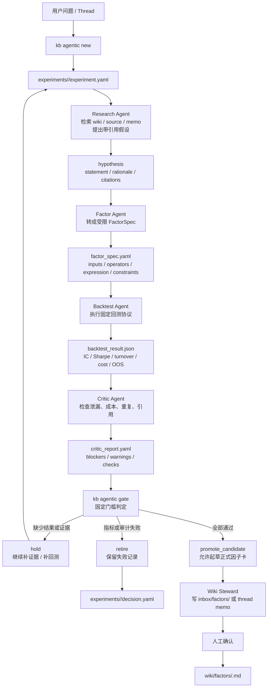
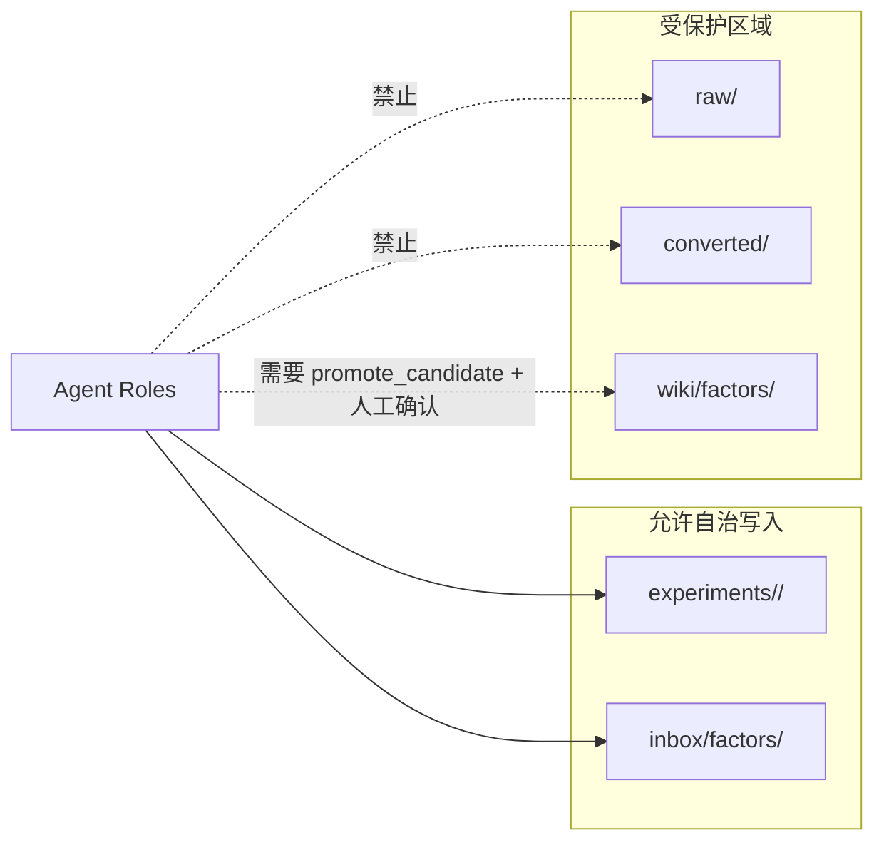

# 半自治 Agent 流程图

本流程图描述 `kb agentic` 的默认编排。核心原则是：agent 可以自治地产生候选和证据，但正式知识库写入必须经过固定 gate。

## 主流程

## 写入边界

## Gate 口径

默认 gate 在 [src/kb/agentic.py](../src/kb/agentic.py) 中定义：

- `min_abs_ic_t: 3.0`
- `min_long_short_sharpe: 1.0`
- `max_turnover: 5.0`
- 必须有 OOS 窗口
- 必须有交易成本结果
- critic 不得有 blockers

缺少必要字段时默认 `hold`；明确低于门槛或有 blocker 时 `retire`；全部通过才是 `promote_candidate`。
